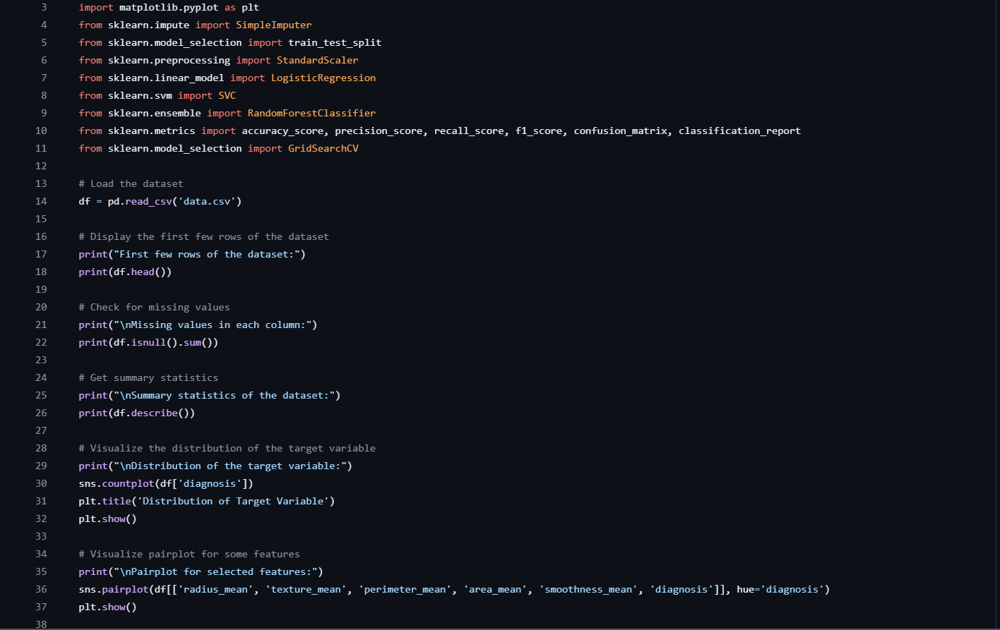

# Breast Cancer Wisconsin (Diagnostic) Dataset Analysis

### How to Run the Script

1. **Setup PyCharm Project**:
    - Open PyCharm and create a new project.
    - Place the `data.csv` file in the project directory.

2. **Install Required Libraries**:
    Ensure you have all the required libraries installed. You can install them using the following command in your terminal or command prompt:

    ```bash
    pip install pandas seaborn matplotlib scikit-learn
    ```

3. **Run the Script**:
    - Copy the above script into a new Python file, e.g., `breast_cancer_analysis.py`.
    - Run the script from PyCharm by right-clicking the file and selecting "Run".
<br>
<p></p>


## 1. Introduction
This section will provide an overview of the dataset and define the objective of the analysis.

### 1.1 Project Overview
Here, you will describe the problem statement and what you aim to achieve with this analysis.

### 1.2 Dataset Description
Detail the features included in the dataset and any relevant information about the data source.

## 2. Data Exploration
In this section, you will perform initial inspections and visualizations of the dataset.

### 2.1 Initial Data Inspection
Discuss your first impressions of the dataset and any notable aspects.

### 2.2 Summary Statistics
Provide statistical summaries of the data to gain insights into its distribution.

### 2.3 Visualizations
Create visual representations of the data to better understand its characteristics.

## 3. Data Preprocessing
Outline the steps taken to prepare the data for modeling.

### 3.1 Handling Missing Values
Explain your approach to dealing with incomplete data.

### 3.2 Encoding Categorical Variables
Discuss how you transformed categorical data into a format suitable for modeling.

### 3.3 Feature Scaling
Justify the need for scaling features and describe the method used.

## 4. Model Building
Describe each model used, including their assumptions and why they were chosen.

### 4.1 Logistic Regression
Detail how you implemented logistic regression and its performance metrics.

### 4.2 Support Vector Machine (SVM)
Explain SVM's implementation and evaluate its effectiveness for this dataset.

### 4.3 Random Forest
Discuss the random forest model, its configuration, and results.

## 5. Model Evaluation
Compare the performance of each model using various evaluation metrics.

### 5.1 Evaluation Metrics for Each Model
Present a detailed analysis of each model's performance indicators.

### 5.2 Comparison of Models
Summarize the strengths and weaknesses of each model in comparison to others.

## 6. Model Tuning
Explain how you optimized the best-performing model for better results.

### 6.1 Hyperparameter Tuning for Random Forest
Describe the process of fine-tuning random forest parameters and its impact on performance.

### 6.2 Evaluation of the Tuned Model
Assess the tuned model's performance and discuss any improvements observed.

## 7. Conclusion
Conclude with a summary of findings, highlighting the best-performing model and potential areas for further research or improvement.

